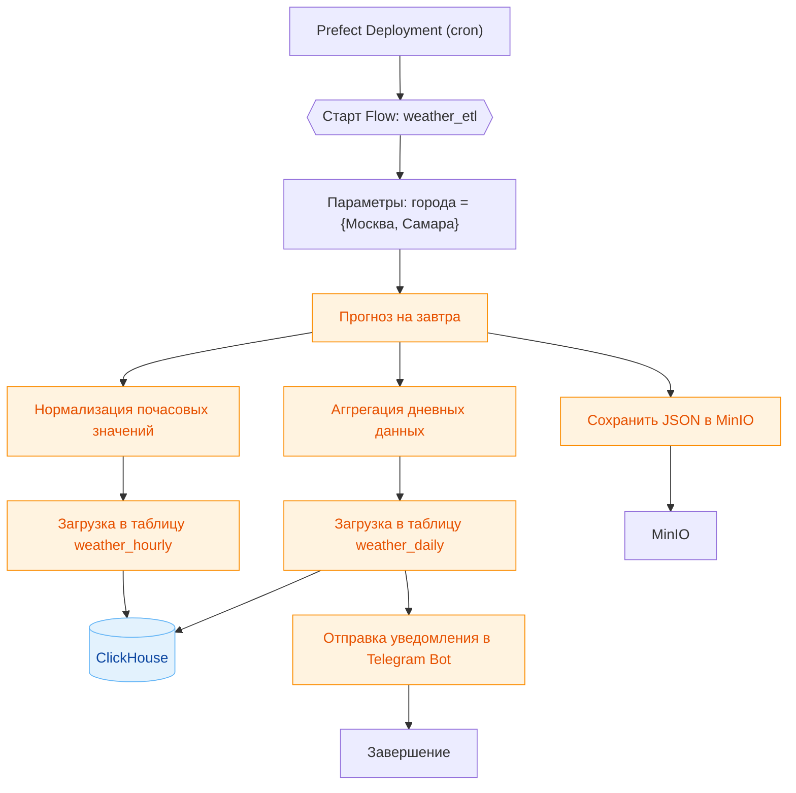
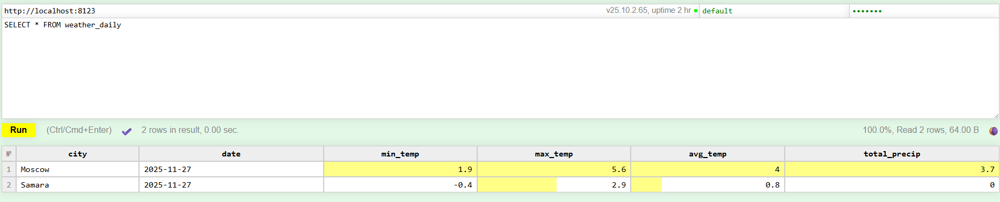
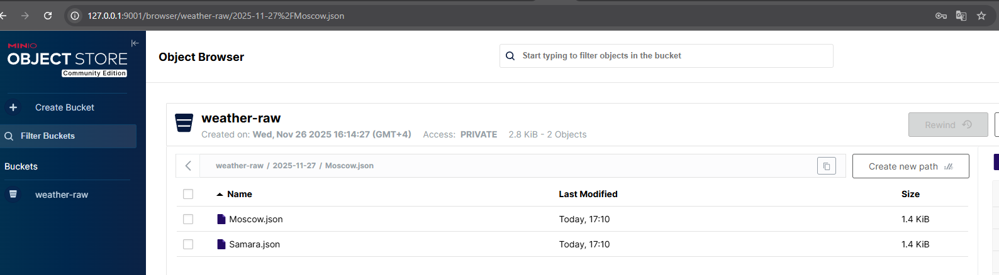

# Отчет о выполнении лабораторной работы №1

## Описание
Проект выполняет ежедневный сбор прогноза погоды для **Москвы** и **Самары** с сервиса [Open-Meteo](https://open-meteo.com/). Пайплайн реализован в виде изолированных Docker-контейнеров, связанных в единую сеть. Логика работы построена по принципу **ELT (Extract - Load - Transform)**: данные сначала сохраняются в "сыром" виде, а затем трансформируются.





## Инструменты

*   **Python 3.13** - используется для описание ETL логики.
*   **Prefect 3** - оркестратор, нужен в целом для запуска пауплайна и обработки ошибок.
*   **Docker** - используем чтобы поднимать среду одной командой.
*   **ClickHouse** - используем для хранения агрегированных данных, почему именно это? так в задании.
*   **MinIO** - используем для хранения сырых данных

## Источник данных
Получаем данные из публичного API Open-Meteo.
- **Эндпоинт:** https://api.open-meteo.com/v1/forecast
- **Параметры запроса:**
  - **latitude/longitude:** Координаты для Москвы и Самары.
  - **hourly:** Температура (temperature_2m), осадки (precipitation), скорость и направление ветра.
  - **start_date/end_date:** Динамически вычисляются как `date.today() + 1 day` (прогноз на завтра).
  - **timezone**: auto.

## Описание ETL
Данные проходят полный цикл обработки:
1.  **Extract:** Получение прогноза у внешнего API (сырой JSON файл). В случае сбоя Prefect автоматически перезапускает задачу до 3-х раз.
2.  **Load (Raw):** Сохранение "сырых" данных в **MinIO**.
3.  **Transform:** Обработка данных (в нашем случае формируется DataFrame из почасовых данных и эти данные агрегируются).
4.  **Load (DWH):** Загрузка в **ClickHouse** (`weather_hourly` - детальные данные, `weather_daily` - агрегированнные данные).

После ETL происходит отправка сообщения в чат **Telegram**.

## Как запустить?

```bash
git clone https://github.com/ВАШ_НИК/Lab-1-2025.git
cd Lab-1-2025
docker compose up -d --build
```

### Важно

Чтобы все заработало нужно создать config.py, ну и заполнить его соответсвенно

```bash
# Telegram Bot
TOKEN_BOT = "ВАШ_ТОКЕН"
ID_BOT = "ВАШ_CHAT_ID"

# MinIO Config
MINIO_ACCESS_KEY = "minioadmin"
MINIO_SECRET_KEY = "minioadmin"
MINIO_BUCKET = "weather-raw"

# ClickHouse Config
CLICKHOUSE_PORT = 8123
CLICKHOUSE_USER = "default"
CLICKHOUSE_PASSWORD = "default"
```

## Результат

После успешного запуска доступны следующие интерфейсы:

| Сервис        | Адрес                  | Логин / Пароль (по умолчанию) |
|---------------|------------------------|-------------------------------|
| MinIO Console | http://localhost:9001  | minioadmin / minioadmin       |
| ClickHouse    | localhost:8123         | default / default             |


По логике должен еще быть доступен Prefect UI, но у меня какие то проблемы с ним (именно с ui).

###  Логи Prefect

Подтверждение успешного выполнения пайплайна (статус Completed):docker compose logs etl-worker                                                                  


```text
weather_etl_worker  | 14:39:19.592 | INFO    | Flow run 'elegant-kiwi' - Beginning flow run 'elegant-kiwi' for flow 'weather_etl_flow'
weather_etl_worker  | 14:39:19.658 | INFO    | Task run 'Init DB & MinIO-221' - ClickHouse tables initialized.
weather_etl_worker  | 14:39:19.660 | INFO    | Task run 'Init DB & MinIO-221' - Finished in state Completed()
weather_etl_worker  | 14:39:20.017 | INFO    | Task run 'Extract Forecast-213' - Data fetched for Moscow on 2025-11-27
weather_etl_worker  | 14:39:20.019 | INFO    | Task run 'Extract Forecast-213' - Finished in state Completed()
weather_etl_worker  | 14:39:20.079 | INFO    | Task run 'Load to MinIO-4d9' - Saved 2025-11-27/Moscow.json to MinIO
weather_etl_worker  | 14:39:20.081 | INFO    | Task run 'Load to MinIO-4d9' - Finished in state Completed()
weather_etl_worker  | 14:39:20.163 | INFO    | Task run 'Load ClickHouse-119' - Inserted data for Moscow into ClickHouse
weather_etl_worker  | 14:39:20.165 | INFO    | Task run 'Load ClickHouse-119' - Finished in state Completed()
weather_etl_worker  | 14:39:20.507 | INFO    | Task run 'Send Telegram-a50' - Telegram notification sent.
weather_etl_worker  | 14:39:20.509 | INFO    | Task run 'Send Telegram-a50' - Finished in state Completed()
weather_etl_worker  | 14:39:20.824 | INFO    | Task run 'Extract Forecast-41f' - Data fetched for Samara on 2025-11-27
weather_etl_worker  | 14:39:20.882 | INFO    | Task run 'Load to MinIO-046' - Saved 2025-11-27/Samara.json to MinIO
weather_etl_worker  | 14:39:20.955 | INFO    | Task run 'Load ClickHouse-be2' - Inserted data for Samara into ClickHouse
weather_etl_worker  | 14:39:21.233 | INFO    | Task run 'Send Telegram-307' - Telegram notification sent.
weather_etl_worker  | 14:39:21.289 | INFO    | Flow run 'elegant-kiwi' - Finished in state Completed()
```

###  Данные в ClickHouse
Результат выборки данных из таблицы **weather_hourly**:


Результат выборки данных из таблицы **weather_daily**:



###  Данные в MinIO

Демонстрация сохраненных JSON-файлов в бакете **weather-raw**:


###  Уведомления в Telegram
Пример полученного прогноза:


## Выводы

В ходе лабораторной работы был освоен полный цикл ETL-разработки.

Сложности и решения:
1. Во время выполнения возникла проблема "Race Condition". Контейнер с Python-скриптом запускался быстрее сервера Prefect, что вызывало ошибку httpx.ConnectError. Решаем перезапуском (была идея сделать проверку перед запуском, но она не сработала), что позволило сервису автоматически восстановиться после инициализации сервера.
2. Еще возникала проблема с правами доступа. При монтировании локальных папок (./ch_data) возникали ошибки прав доступа (Permission denied). Перешел на использование именованных Docker Volumes.